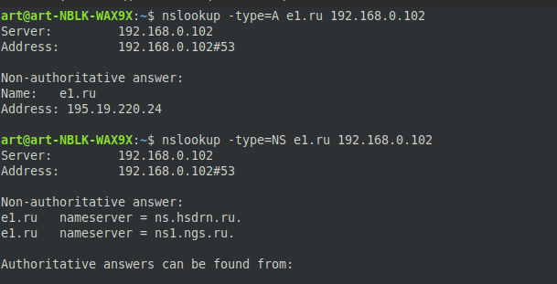
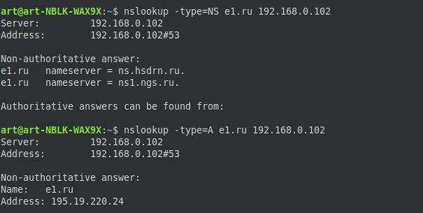
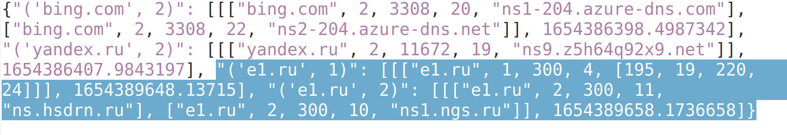

Задание 4 (Кэширующий DNS-сервер)
=====================
Для запуска скрипта, необходимо предварительно установить интерпретатор python.

Запуск производится через консоль (cmd - Windows / bash_terminal - Unix)

    $ python3 server.py

<li> server.py - имя исполняемого файла

Программа сама получит ваш IPv4-адрес, обратившись к серверу 8.8.8.8
(В моём случае это адрес 192.168.0.102, адрес шлюза моего маршрутизатора)

Проверим работоспособность:
------------------
 Я буду пользоваться утилитой nslookup (также можно использовать аналог dig)
 
 <li>
 Запустим сервер и получим наш адрес
 </li>
 
 
 
 <li>
 Сделаем запросы ресурсных записей типов A и NS (именно их обработка поддерживаются нашим сервером) интересующего нас доменного имени (наприме, e1.ru), дополнительно указав наш адрес
 </li>

 
 
   
 <li>
 Для чистоты эксперимента я отключу доступ к интернету, отсоединив из шлюза маршрутизатора ethernet-кабель
 </li>
 
=
 <li>
 Сделаем повторные запросы
 </li>
 
 

 <li>
 Для сериализации в кэш был использован файл формата json, в котором записываются данные по ключам (домен + тип ресурсной записи). При новой загрузке сервера, устаревшие записи удаляются из файла
 </li>
 
 
