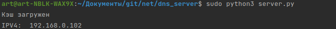

Задание 4 (Кэширующий DNS-сервер)
=====================
Для запуска скрипта, необходимо предварительно установить интерпретатор python.

Запуск производится через консоль (cmd - Windows / bash_terminal - Unix)

    $ python3 server.py

<li> server.py - имя исполняемого файла

Программа сама получит ваш IPv4-адрес, обратившись к серверу 8.8.8.8
(В моём случае это адрес 192.168.0.102, адрес шлюза моего маршрутизатора)

Проверим работоспособность:
------------------
 Я буду пользоваться утилитой nslookup (также можно использовать аналог dig)
 
 <li>
 Запустим сервер и получим наш адрес
 </li>
 
 
 
 <li>
 Сделаем запрос информации о интересующем нас доменном имене (наприме, vk.com), указав наш адрес
 </li>

 
 
 <li>
 Видим, что сервер обработал результаты запроса
 </li>
 
 

 <li>
 Для чистоты эксперимента я отключу доступ к интернету, отсоединив из шлюза маршрутизатора ethernet-кабель
 </li>
 
 <li>
 Сделаем запросы на ресурсные записи типов A и NS (именно обработка A (Address) и NS (Name server) поддерживаются нашим сервером)
 </li>
 
 
