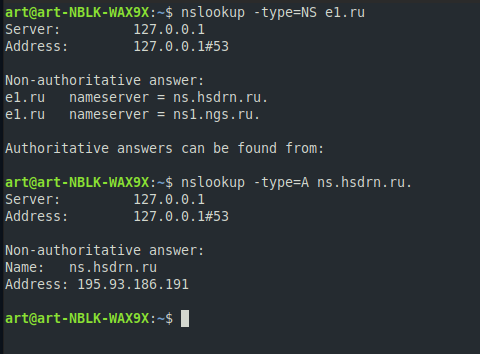
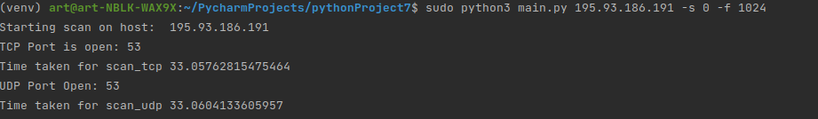
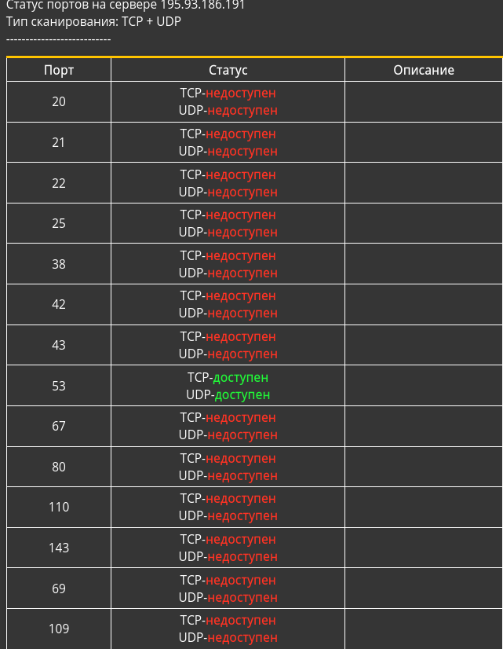

Задание 3 (сканирование TCP и UDP портов, параллельная реализация)
=====================
Для запуска скрипта, необходимо предварительно установить интерпретатор python.

Запуск производится через консоль (cmd - Windows / bash_terminal - Unix) с передачей необходимых аргументов

    $ python3 main.py host_name [-s] [-f] [-tcp] [-udp]

<li> main.py - имя исполняемого файла

Позиционный аргмент:
  <li>
  *host_name [адрес хоста]
 
Аргументы опциональные:
  <li>
  *-s [левая граница полуинтервала номеров портов]
  <li>
  *-f [правая граница, не включена]

Аргументы-теги:
  <li>
  *-tcp [при необходимости в сканировании tcp портов]
  <li>
  *-udp [аналогично для udp портов]
  (если не указать ни один из тегов, то будут рассмотрены и UDP и TCP)

Проверим работоспособность:
------------------
 <li>
 Для начала посмотрим адрес DNS сервера, ответственного за интересующий нас домен, например e1.ru
 </li>

 
 
 <li>
 Запустим скрипт, указав этот адрес (или доменное имя)
 </li>
 
 

 <li>
 Проверим результат работы, сделав аналогичный запрос на готовом онлайн-сервисе, предоставляющем услугу проверки портов udp и tcp
 </li>
 
 

 Результат: Открыты 53 порты tcp и udp
