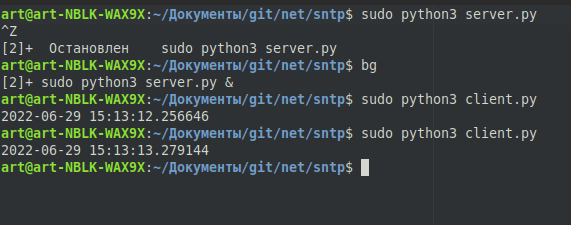

Задание 2 (Лгущий SNTP-сервер времени)
=====================
Для запуска скрипта, необходимо предварительно установить интерпретатор python.

Запуск сервера производится через консоль (cmd - Windows / bash_terminal - Unix)

    $ python3 sever.py

<li> sever.py - имя исполняемого файла

Далее время запрашивается через запуск клиента в консоли (cmd - Windows / bash_terminal - Unix)

    $ python3 clien.py

<li> client.py имя исполняемого файла
  
  <b>В файле config.txt записывается сдвиг времени в секундах (целое число)

Проверим работоспособность:
------------------
 <li>
 Сервер:
 </li>

 
 
 <li>
 Клиент:
 </li>
 
 
