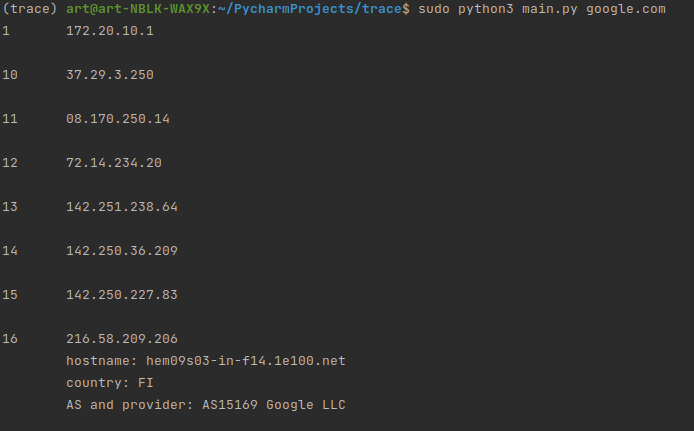

Задача 1. Трассировка автономных систем
========================================
All essential comments to my work are included in code itself

To start script type:

    $ python3 {script_name} {host_name}

If you are using Windows-OS you may face a problem with OS-error,
  it could be an exception from string, where we fetch argument to subprocess to execute 
  (in 16th line in different operating systems it may very from "traceroute" to "tracert" -> try to replace string "traceroute" to "tracert")

A sample result of running the script:
------------------
 

