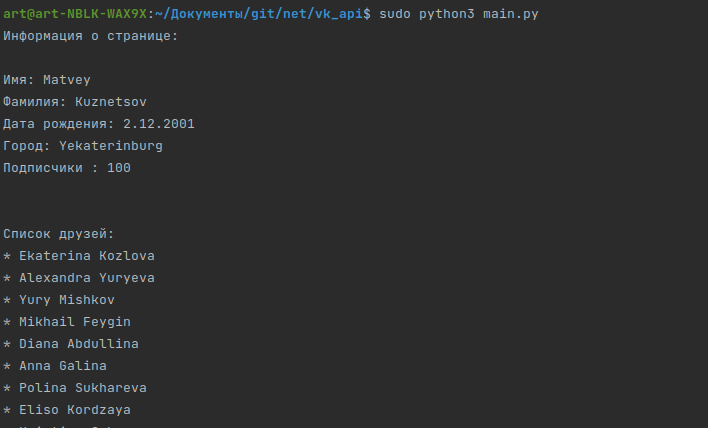
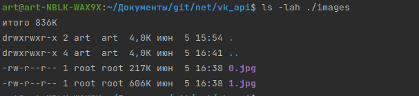

Задание 8 (VK-API)
=====================
Для запуска скрипта, необходимо предварительно установить интерпретатор python.

Запуск производится через консоль (cmd - Windows / bash_terminal - Unix)

    $ python3 main.py

<li> main.py - имя исполняемого файла

Программа получит необходимые данные (access_token и user_id) из файла config.py, в который нужно предварительно ввести их значения

Пример работы:
------------------
 
 <li>
 Запустим скрипт и получим данные пользователя (о его странице и списке друзей)
 </li>
 
 
 
 <li>
 После работы программы в папку images будут загружены фотографии из страницы пользователя с user_id
 </li>

 
